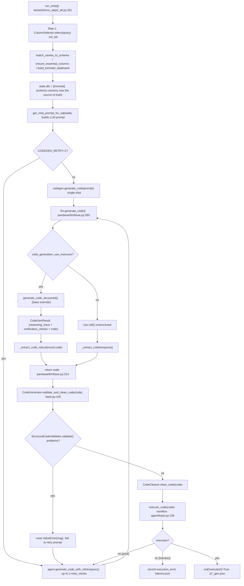
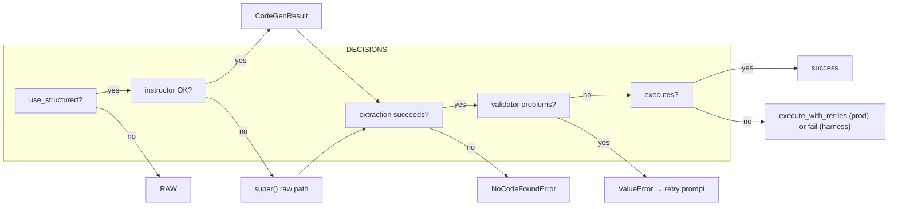

# v5 Structured Codegen — Logic Map

> **Scope of this map:** what the current codebase actually does when it generates
> code for a natural-language query, from harness entry point to executed result.
> This is the **Logic Mapping Technique** (Phase 1 — Trace) applied to the
> committed v5 structured-codegen pipeline (commit `71017b4b`, branch
> `jya0-v3.0.0`).
>
> Companion: the reference run is `v7` (10/10 validators, 8/10 executed) at
> `/tmp/codegen_v7_final/20260811_203359_step2_thinking_on/`.

---

## 1. Entry Points

There are two real entry points that matter for the pipeline:

| Entry point                     | File:line                                                                              | Purpose                                                                              |
| ------------------------------- | -------------------------------------------------------------------------------------- | ------------------------------------------------------------------------------------ |
| **Harness (measurement)** | `tests/e2e/run_step2_all.py:main()` → `run_one(q)`                                | The isolated, single-shot, per-question pipeline used to measure first-try accuracy. |
| **Production (recovery)** | `pandasai/agent/base.py` → `chat()`/`chat_fit()` (via `execute_with_retries`) | The real path that loops on execution errors.                                        |

Everything below is the **harness path** because that is what produced the v7
numbers; the production differences are called out at the branch points.

---

## 2. Top-level flow diagram



---

## 3. Call-chain trace (file:line references)

### 3.1 Step 1 — column selection

`run_one` → `ColumnSelector.select(run_query)` (wraps `agent.start_new_conversation`

+ structured selection). The selection prompt asks the model for a bounded set of
  `[Table[Column]]` names; the output is **applied back onto the DataFrame** as a
  *trimmed* frame, so from Step 2 onward `state.dfs[0].schema.columns` reflects only
  the chosen columns. This is the schema the codegen validator replays against.

- `tests/e2e/run_step2_all.py:262` — `sel = ColumnSelector(state)`
- `tests/e2e/run_step2_all.py:268` — `selected = sel.select(run_query)`
- `tests/e2e/run_step2_all.py:277-280` — `sel.match_names_to_schema`, `ensure_essential_columns`, `build_trimmed_dataframe`
- `tests/e2e/run_step2_all.py:281` — `state.dfs = [trimmed ...]`

### 3.2 Step 2 — structured code generation (the v5 core)

The trimmed DataFrame is used to build the codegen prompt, then handed to the LLM
through a **structured, bounded** response contract.

- `run_step2_all.py:284` — `prompt = get_chat_prompt_for_sql(state)`
- `run_step2_all.py:286` — `codegen = CodeGenerator(state)`
- `run_step2_all.py:299` — `code = codegen.generate_code(prompt)` (single-shot) **OR** `agent.generate_code_with_retries(query)` (retry path)
- `pandasai/llm/base.py:283` — `generate_code()` reads `context.config.code_generation_use_instructor`
- `pandasai/llm/base.py:294-316` — structured branch:
  - `generate_code_structured()` → `CodeGenResult`
  - stores `_last_structured_reasoning`, `_last_structured_double_check`, `_last_structured_verification_checks`
  - returns `_extract_code_robust(result.code)`
- `extensions/llms/litellm/pandasai_litellm/litellm.py:237` — **LiteLLM override**:
  - builds `messages` from `context.memory`
  - calls `instructor.from_litellm(completion, mode=Mode.MD_JSON).create_with_completion(response_model=CodeGenResult, ...)`
  - on exception → falls back to `super().generate_code_structured()` (raw path, degraded)
  - emits `[LLM-CALL][STRUCTURED]` per-call log line
- `pandasai/core/code_generation/structured.py:58` — `CodeGenResult` (Pydantic): `reasoning_trace`, `verification_checks: List[VerificationCheck]`, `code`; `double_check` is a derived property.
- `pandasai/llm/base.py:120` — `_extract_code_robust()`: 4 fallbacks (standard extraction → largest fenced block → largest parseable substring → strip prose to first `import`). Fixed Q15 "No code found".

### 3.3 Step 3 — deterministic structural self-review (the validator)

After the LLM returns code, **before** execution, a deterministic, schema-driven
validator replays every `[Table[Column]]` reference in the code against the actual
schema columns.

- `pandasai/core/code_generation/base.py:105` — `validate_and_clean_code()`
- `pandasai/core/code_generation/base.py:123` — `_run_structural_self_review(code)`:
  - builds `StructuralCodeValidator(df.schema.columns)` (`_build_structural_validator`, `base.py:138`)
  - `structural_validator.validate(code)` returns a `List[str]` of problems
  - on problems → raises `ValueError(msg)` so the retry prompt receives the exact issue
- `pandasai/core/code_generation/structural_validator.py:125` — `validate()`:
  - **struct-key check** (`_check_struct_field_keys`) — exact case/brackets, catches `]]'` / `['` typos, bracket mismatch
  - **alias consistency** (`_check_alias_consistency`) — full quoted multi-word alias capture
  - **undefined variables** (`_check_undefined_variables`) — full `assigned` set, lambda params, broad Load scan (catches control-flow undefined vars)
  - **self-reference** (`_check_self_reference_result`) — `result = {...: result}` NameError
  - **derived-column tracking** — `df['new_col'] = ...` collected as valid accessors (not invented aliases)

### 3.4 Step 4 — execution

- `run_step2_all.py:333` — `agent.execute_code(out["code"])`
- `pandasai/agent/base.py:139` — `execute_code` → `code_executor.execute_and_return_result(code)`
- `pandasai/core/code_execution/code_executor.py:28` — `exec(code, environment)` (sandbox pre-defines `pd`, `plt`, `np`)
- Success → `out["executed"]=True`, serialized into `Q{num}_gen.json`
- Failure → `out["execution_error"]`, recorded into `failures.json`

---

## 4. Branch points (where the pipeline can diverge)



### 4.1 Structured vs raw

- `code_generation_use_instructor=True` (env `CODE_GENERATION_USE_INSTRUCTOR`) → structured. This is the v5 default and the whole point of the change.

### 4.2 Instructor fallback

- If instructor itself fails (schema validation exception, model rejected), LiteLLM logs `[LLM-CALL] structured codegen failed; falling back to raw call()` and uses the base `generate_code_structured()` → raw `call()` + `_extract_code`. Codegen **degraded but not aborted**.

### 4.3 Validator → retry (the key "catch-before-execute" gate)

- Any structural problem (wrong struct key, invented alias, undefined var, `result` self-reference) raises `ValueError` *before* execution. In production the agent's `_regenerate_code_after_error` feeds that exact message into the retry LLM call, so the next attempt fixes the precise issue. This is why 10/10 pass the validator.

### 4.4 Execution failure (runtime-only, not statically catchable)

- Two failures remain in the harness, both **runtime** (not validator) errors, both recoverable by `execute_with_retries` in production:
  - **Q3**: `TypeError: unsupported operand type(s) for -: 'datetime.date' and 'Timestamp'` — a date arithmetic type mismatch (schema says `datetime.date`, dataframe gives `Timestamp`). No static check can catch this.
  - **Q15**: `KeyError: 'plan_plan'` — alias drift inside a dict literal (`goal_plan` → `plan_plan`), a value error, not a reference/struct error, so the validator's reference checks can't see it.

---

## 5. Side effects (observability)

1. **Per-LLM-call logging** — `[LLM-CALL][STRUCTURED] done in {s}s | code={n} chars | reasoning_trace={n} chars | verification_checks={n} | thinking_trace={n} chars` emitted from `litellm.py:351`, captured into `out["codegen_llm_calls"]` / `out["llm_calls"]`.
2. **Per-attempt instrumentation** — `litellm.py:14-62` registers `success_callback`/`failure_callback`; every provider attempt (including hidden retries) appended to module `_ATTEMPTS`. `get_attempt_log()` exposes them. This is what disproved "the model is slow" — the dashboard only shows successful attempts, so wall-clock vs. attempt-time mismatched.
3. **Structured audit fields** — `state.code_generation_structured_reasoning`, `code_generation_structured_double_check`, `code_generation_structured_verification_checks` captured from `base.py:53-64` and written into `Q{num}_gen.json`.
4. **Thinking trace** — `state.code_generation_thinking_trace` / `column_selection_thinking_trace` from `llm._last_thinking_trace` (DeepSeek `reasoning_content`).

---

## 6. Where "v5" is and is not correct

**Correct (what v5 solves):**

- The **bounded 3-section response** (reasoning_trace + verification_checks + code) keeps thinking-mode's reasoning benefit while forcing the model to *commit to code and stop* — this is what kills the DeepSeek-V4-Flash-0731 reasoning-loop "hang". `max_tokens=10000` caps even a runaway.
- The **deterministic validator** catches schema bugs (struct keys, aliases, undefined vars, self-reference) *before* execution, so the retry budget is spent on real issues, not wasted executions.
- **Robust extraction** (`_extract_code_robust`) prevents "No code found" false negatives on fenced/prose-wrapped long programs (Q15).

**Not "v5" / known residual:**

- The validator is **static** — it cannot catch runtime type mismatches (Q3) or dict-key drift (Q15). These need `execute_with_retries` (production) or a runtime error-recovery pass (harness single-shot deliberately does *not* retry execution, so it under-reports vs. production).

---

## 7. Deliverable checklist (Phase 2 — Test)

To reproduce the logic map, re-run:

```bash
cd /home/jyao/ADEO/service/pandas-ai
set -a && . ./.env && set +a && source .venv/bin/activate
export NODE_TLS_REJECT_UNAUTHORIZED=0 SSL_CERT_FILE="" REQUESTS_CA_BUNDLE=""
OUTPUT_DIR=/tmp/codegen_v7_final \
STRUCTURED_LLM_MODEL_NAME="openai/deepseek-ai/DeepSeek-V4-Flash-0731" \
STRUCTURED_LLM_THINKING=false \
CODE_GENERATION_USE_INSTRUCTOR=true \
CODE_GENERATION_THINKING=false \
CODE_GENERATION_TEMPERATURE=0.2 \
CODE_GENERATION_MAX_TOKENS=10000 \
CODEGEN_CONCURRENCY=4 \
CODEGEN_RETRY=1 \
.venv/bin/python tests/e2e/run_step2_all.py
```

Then confirm per-question `Q*_gen.json` has: `code`, `codegen_structured_reasoning`, `codegen_structured_verification_checks`, `validators_passed`, `executed`, and `llm_calls` (with `[LLM-CALL][STRUCTURED]` lines) — and `failures.json` lists only the runtime-only Q3/Q15.
